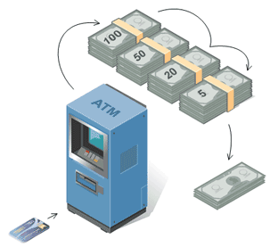
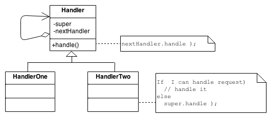
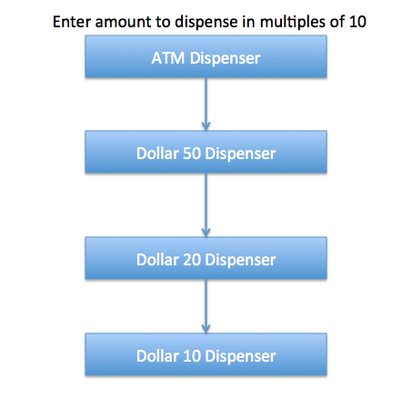
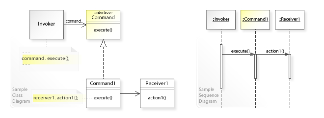

## Chain of Responsibility


**Chain of Responsibility** is a behavioral design pattern that lets you pass requests along a chain of handlers. Upon
receiving a request, each handler decides either to process the request or to pass it to the next handler in the chain.

Like many other behavioral design patterns, the Chain of Responsibility relies on transforming particular behaviors into
stand-alone objects called handlers.

### Intent

- Avoid coupling the sender of a request to its receiver by giving more than one object a chance to handle the request.
  Chain the receiving objects and pass the request along the chain until an object handles it.


- _Launch-and-leave_ requests with a single processing pipeline that contains many possible handlers.


- An object-oriented linked list with recursive traversal.

### Structure

The derived classes know how to satisfy Client requests. If the "current" object is not available or sufficient, then it
delegates to the base class, which delegates to the "next" object, and the circle of life continues.

Multiple handlers could contribute to the handling of each request. The request can be passed down the entire length of
the chain, with the last link being careful not to delegate to a "null next".

### Chain of Responsibility Pattern Example in JDK

We know that we can have multiple catch blocks in a `try-catch` block code. Here every catch block is kind of a
processor to process that particular exception.

So when any exception occurs in the `try` block, its send to the first `catch` block to process.
If the `catch` block is not able to process it, it forwards the request to next object in chain i.e next `catch` block.
If even the last `catch` block is not able to process it, the exception is thrown outside of the chain to the calling program.

**More examples:**

```java
java.util.logging.Logger#log()
javax.servlet.Filter#doFilter()
```

### Real World Example



- ATMs use the **Chain of Responsibility** in money vending mechanism.
- The user enters the amount to be dispensed and the machine dispense amount in terms of defined currency bills such as
  `$50`, `$20`, `$10` etc.
- If the user enters an amount that is not multiples of 10, it throws error.

### Checklist



1. The base class maintains a "next" pointer.
2. Each derived class implements its contribution for handling the request.
3. If the request needs to be "passed on", then the derived class "calls back" to the base class, which delegates to
   the "next" pointer.
4. The client (or some third party) creates and links the chain (which may include a link from the last node to the root
   node).
5. The client "launches and leaves" each request with the root of the chain.
6. Recursive delegation produces the illusion of magic.


### Implementation



#### Basic Classes and Interface



We can create a class `Currency` that will store the amount to dispense and used by the chain implementations.

```java
public class Currency {
  private int amount;

  public Currency(int amount) {
    this.amount = amount;
  }

  public int getAmount() {
    return this.amount;
  }
}
```

The base interface should have a method to define the next processor in the chain and the method that will process the request.

Our ATM Dispense interface will look like below:

```java
public interface DispenseChain {
  void setNextChain(DispenseChain nextChain);

  void dispense(Currency cur);
}
```

### Chain Implementations

We need to create different processor classes that will implement the `DispenseChain` interface and provide implementation of dispense methods.

Since we are developing our system to work with three types of currency bills - $50, $20 and $10, we will create three
concrete implementations.

```java
public class Dollar50Dispenser implements DispenseChain {

  private DispenseChain chain;

  @Override
  public void setNextChain(DispenseChain nextChain) {
    this.chain = nextChain;
  }

  @Override
  public void dispense(Currency cur) {

    if (cur.getAmount() >= 50) {
      int num = cur.getAmount() / 50;
      int remainder = cur.getAmount() % 50;
      System.out.println("Dispensing " + num + " $50 notes");

      if (remainder != 0)
        this.chain.dispense(new Currency(remainder));

    } else {
      this.chain.dispense(cur);
    }
  }

}
```

```java
public class Dollar20Dispenser implements DispenseChain {

  private DispenseChain chain;

  @Override
  public void setNextChain(DispenseChain nextChain) {
    this.chain = nextChain;
  }

  @Override
  public void dispense(Currency cur) {

    if (cur.getAmount() >= 20) {
      int num = cur.getAmount() / 20;
      int remainder = cur.getAmount() % 20;
      System.out.println("Dispensing " + num + " $20 notes");

      if (remainder != 0)
        this.chain.dispense(new Currency(remainder));

    } else {
      this.chain.dispense(cur);
    }
  }

}
```

```java
public class Dollar10Dispenser implements DispenseChain {

  private DispenseChain chain;

  @Override
  public void setNextChain(DispenseChain nextChain) {
    this.chain = nextChain;
  }

  @Override
  public void dispense(Currency cur) {

    if (cur.getAmount() >= 10) {
      int num = cur.getAmount() / 10;
      int remainder = cur.getAmount() % 10;
      System.out.println("Dispensing " + num + " $10 notes");

      if (remainder != 0)
        this.chain.dispense(new Currency(remainder));

    } else {
      // do nothing
    }
  }

}
```

The important point to note here is the implementation of `dispense` method.
You will notice that every implementation is trying to process the request and based on the amount, it might process some or full part of it.

If one of the chain not able to process it fully, it sends the request to the next processor in chain to process the
remaining request. If the processor is not able to process anything, it just forwards the same request to the next
chain.

### Creating the Chain

This is a very important step and we should create the chain carefully, otherwise a processor might not be getting any
request at all.

For example, in our implementation if we keep the first processor chain as `Dollar10Dispenser` and
then `Dollar20Dispenser`, then the request will never be forwarded to the second processor and the chain will become
useless.

```java
public class ATMDispenseChain {

  private DispenseChain c1;

  public ATMDispenseChain() {
    // initialize the chain
    this.c1 = new Dollar50Dispenser();
    DispenseChain c2 = new Dollar20Dispenser();
    DispenseChain c3 = new Dollar10Dispenser();

    // set the chain of responsibility
    c1.setNextChain(c2);
    c2.setNextChain(c3);
  }

  public static void main(String[] args) {
    ATMDispenseChain atmDispenser = new ATMDispenseChain();

    while (true) {
      int amount = 0;
      System.out.println("Enter amount to dispense");
      Scanner sc = new Scanner(System.in);
      amount = sc.nextInt();

      if (amount % 10 != 0) {
        System.out.println("Amount should be in multiple of 10s.");
        return;
      } else if (amount == 0) {
        System.out.println("Amount must be greater than 0");
        return;
      }

      // process the request
      atmDispenser.c1.dispense(new Currency(amount));
    }
  }
}
```

What is good about the **CoR** pattern is the complete decoupling between the client and the object chain that handles
the
client's request.

In this pattern, the first object in the chain receives the client request.

It either handles it or forwards it to the next object in the chain.

The process goes on until some object in the chain handles the request.

What's interesting here is that the client that made the request has no explicit knowledge of who will handle the
request.

Also, the object who finally handles the request has no knowledge about the client who initiated the request.

### Chain of Responsibility Design Pattern Important Points

- Client doesn't know which part of the chain will be processing the request and it will send the request to the first
  object in the chain. For example, in our program ATMDispenseChain is unaware of who is processing the request to
  dispense the entered amount.


- Each object in the chain will have it's own implementation to process the request, either full or partial or to send
  it to the next object in the chain.


- Every object in the chain should have reference to the next object in chain to forward the request to, its achieved by
  _Java composition_.


- Creating the chain carefully is very important otherwise there might be a case that the request will never be
  forwarded to a particular processor or there are no objects in the chain who are able to handle the request.


- **CoR** pattern is good to achieve loose coupling, but it comes with the trade-off of having a lot of implementation
  classes and maintenance problems if most of the code is common in all the implementations.